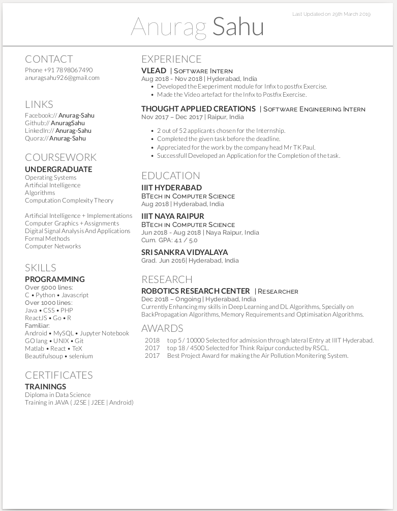

My RESUME
==============

Hey There folks,
I was just staking one of my seniors at collage through github ;P and saw the resume on his website. It was a very organised and a resume with many feathers on his hat,  
Shivam Khandewal [https://github.com/skbly7]. 
 
I searched about TeX and found out that is a very good markup language specially if you are looking for resumes. And found out that the resume templete was made by Debarghya Das [https://github.com/deedy]. He is an software engineer at Facebook. 

I really liked the resume template, so I put on my resume on top of it. 
In order to see the the resume 
## Dependencies
 on linux (I have not tried it on windows)
- install xetex and bibtex by 
'''sh
sudo apt-get update
sudo apt-get install texlive-xetex
sudo apt-get install texlive-bibtex-extra biber
'''
- go to terminal

'''sh
git clone https://github.com/AnuragSahu/Anurag_Sahu_Resume.git
cd Anurag_Sahu_Resume/OpenFonts/
xelatex anurag_sahu_resume.xtx

'''

If you want to make your own Resume just Edit the File anurag_sahu_resume.xtx
tada there you go the resume is up just check the anurag_sahu_resume.pdf
 
 ## Snapshot
 
 
