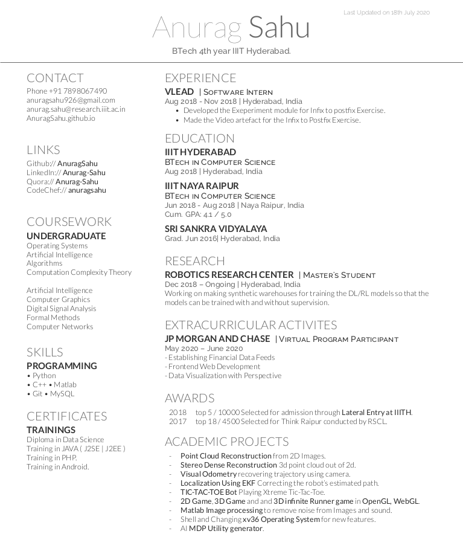

My RESUME
==============
In order to see the the resume<br>
## Dependencies
 on linux (I have not tried it on windows)
- install xetex and bibtex by 
```
sudo apt-get update
sudo apt-get install texlive-xetex
sudo apt-get install texlive-bibtex-extra biber
```
- go to terminal

```sh
git clone https://github.com/AnuragSahu/Anurag_Sahu_Resume.git
cd Anurag_Sahu_Resume/OpenFonts/
xelatex anurag_sahu_resume.xtx

```

If you want to make your own Resume just Edit the File anurag_sahu_resume.xtx
tada there you go the resume is up just check the anurag_sahu_resume.pdf
 
 ## Snapshot
 
 <!--  -->
 <object data="https://github.com/AnuragSahu/MyResume/blob/master/SWe/anurag_sahu_resume.pdf" type="application/pdf" width="700px" height="700px">
    <embed src="https://github.com/AnuragSahu/MyResume/blob/master/SWe/anurag_sahu_resume.pdf">
        <p>This browser does not support PDFs. Please download the PDF to view it: <a href="https://github.com/AnuragSahu/MyResume/blob/master/SWe/anurag_sahu_resume.pdf">Download PDF</a>.</p>
    </embed>
</object>

